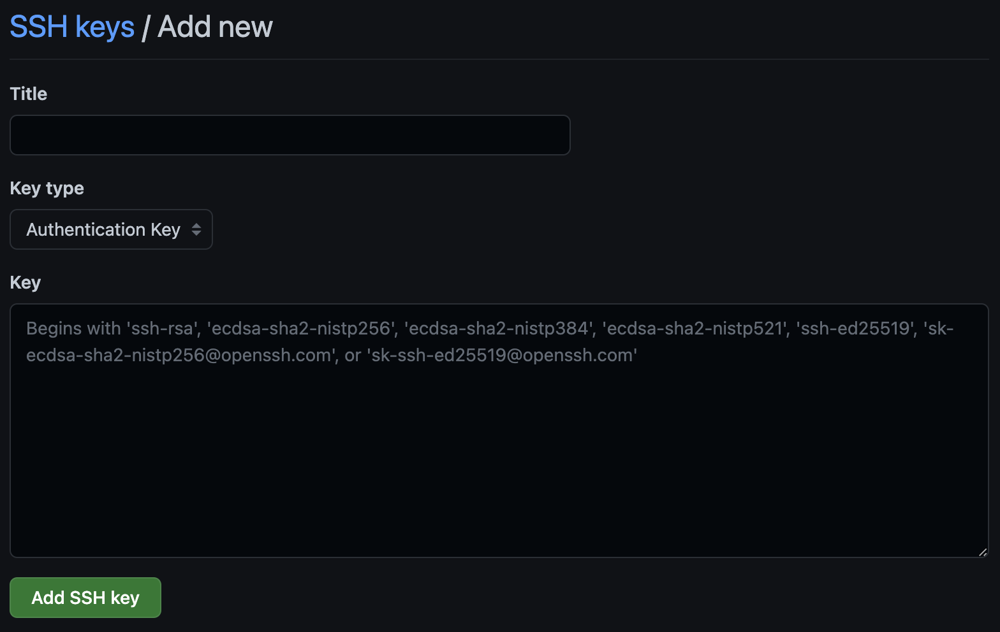
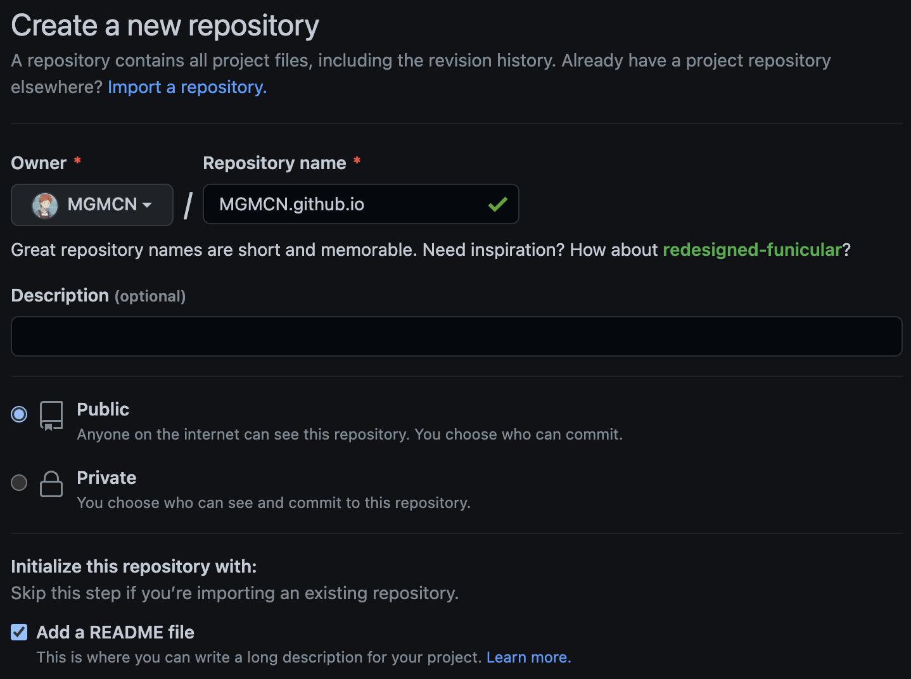

# FastCV


A complete beginner's tutorial shows you how to build your personal cv with [hugo](https://github.com/gohugoio/hugo) and display it using [github.io](https://docs.github.com/en/pages).
## Environment
> For mac user 👇🏻  
> MacOS Ventura 13.2  
> Hugo version -> hugo v0.110.0+extended darwin/arm64   
> For linux user 👇🏻  
> Ubuntu 20.04.5 LTS (GNU/Linux 5.4.0-131-generic x86_64)  
> Hugo version -> Hugo Static Site Generator v0.68.3/extended linux/amd64    
> For windows user 👇🏻  
> Windows 11 21H2 22000.376  
> Hugo version -> v0.111.0-3fa8bb8318114cd69315eadd35bda169e6a8ca4b+extended windows/amd64
### Windows
If you are a windows user, please install chocolatey and git first. See -> [how-to-use-chocolatey-choco-to-install-git-on-windows](https://www.geeksforgeeks.org/how-to-use-chocolatey-choco-to-install-git-on-windows/).   
Then choose a directory to open git-bash.  
Then execute the following command to build your cv locally.  
```Bash
$ sh build-windows-x86_64.sh
```
# Get start
## Automate the local build process (suggested)
If you want to skip the git-tools installation chapter and hugo installation chapter and local build chapter, then execute the following command.
```Bash
$ chmod +x build-macos-arm_64.sh # If you are a linux user please try build-linux-x86_64.sh
$ echo "hugo server --source hugoServer/mycv" >> build-macos-arm_64.sh
$ ./build-macos-arm_64.sh
```
After executing this build script, please jump directly to [step-configure-ssh](#configuressh) and [step-create-repository](#createrepository). Then jump to [step-deploy](#deploy).
## Install Git
For most people who use github, I assume they have git installed correctly. But if you are new to github and don't have git installed, plz check out [link](https://git-scm.com/download/mac).
## Install homebrew
Homebrew is a free and open source package management system that simplifies the installation of software on macOS systems.
```Bash
# When you execute the command plz remove '$' first.
$ /bin/bash -c "$(curl -fsSL https://raw.githubusercontent.com/Homebrew/install/master/install.sh)"
```
## <a name="configuressh">Configure SSH key for github</a>
Adding the ssh key is for our later operations to go on smoothly.
```Bash
$ cd ~/.ssh # If you don't have this folder, please google for how to generate ssh key.
$ ls
id_rsa		id_rsa.pub ...
$ cat id_rsa.pub # Copy all your output.
.
.
.
```
Access your github account settings page. (ps:If you are already logged in then just click -> [link](https://github.com/settings/keys)) Find option called SSH key and GPG keys. Create SSH key like 👇🏻. Put the text of the id_rsa.pub you copied into the place of the key below.  

   

## <a name="createrepository">Create a repository for your cv</a>
Notice: repository name should be like your_account_name.github.io. When you visit your github homepage, the string at the end of your link is your_account_name. For me the link is "https://github.com/MGMCN". So my_account_name is "MGMCN".  

  

## Install hugo
```Bash
$ brew install hugo
$ hugo version # Success if version output is available
...
```
## Build our cv locally
```Bash
$ mkdir hugoServer
$ hugo new site hugoServer/mycv
$ git clone https://gitlab.com/mertbakir/resume-a4.git hugoServer/mycv/themes/resume-a4
$ cp hugoServer/mycv/themes/resume-a4/config.yaml hugoServer/mycv/
$ cp -r hugoServer/mycv/themes/resume-a4/exampleSite/data hugoServer/mycv/
$ rm hugoServer/mycv/config.toml # using config.yaml as our config file
$ hugo server --source hugoServer/mycv --disableFastRender # Now you can check your hugo-server is working locally by access http://localhost:1313/ .
```
## <a name="deploy">Deploy our cv to github.io</a>
```Bash
$ hugo --source hugoServer/mycv -D
$ cd hugoServer/mycv/public
$ git init
$ git remote add origin git@github.com:your_account_name/your_account_name.github.io.git
$ git pull origin main
$ git checkout main # Make sure you are on the main branch.
$ git add .
$ git commit -m "first commit"
$ git push -u origin main
...
# Now you can view your cv by visiting your_account_name.github.io
```
## Workflow to edit this cv
Edit these two files. See what has changed by using the local hugo server.
```Bash
$ ls # Now back to our root directory.
.
├── archetypes
├── config.yaml # 👈🏻 This is a configuration file where you can configure.
├── content
├── data # 👈🏻 Your cv details are all in this folder.
│   ├── education.yaml 
│   ├── experience.yaml
│   ├── features.yaml
│   ├── projects.yaml
│   └── publications.yaml
├── layouts
├── public
├── resources
├── static
└── themes
```
When you have edited any one or more of these two files and you want to change the content displayed on github.io.
```Bash
$ ls # First back to our root directory. 
.
├── archetypes
├── config.yaml
├── content
├── data
├── layouts
├── public
├── resources
├── static
└── themes
# Then run 👇🏻
$ hugo -D
$ cd public
$ git checkout main
$ git add .
$ git commit -m "cv updated"
$ git push
# Now you can view your changes by visiting your_account_name.github.io
```
## Hugo Theme we use
Thanks to [resume-a4](https://themes.gohugo.io/themes/resume-a4/). If you need more details about Hugo Themes, please check out [HugoThemes](https://themes.gohugo.io/).
